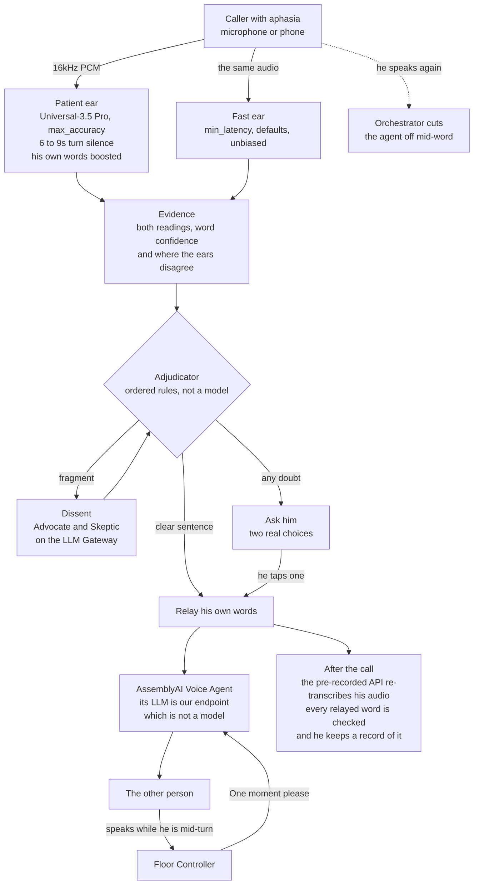

# One Moment

**The voice agent that waits for you.**

One Moment holds the phone line open through a six-second word-finding pause, cuts its own
voice off the instant the caller speaks again, offers two of the caller's own words when
one only half comes out, and says nothing the caller did not say.

It exists so that a person with aphasia can make their own phone call.

| | |
|---|---|
| **Live site** | https://one-moment-mu.vercel.app |
| **Start here if you are judging** | https://one-moment-mu.vercel.app/judges |
| **Three recorded calls** | https://one-moment-mu.vercel.app/replay |
| **Public API and playground** | https://one-moment-mu.vercel.app/api |
| **The engine, on npm** | `npm install @one-moment/core` |

Built for the AssemblyAI Voice Agent Hackathon, September 2026. MIT licensed.
Not a medical device. Not clinically validated. Not tested with people who have aphasia.

---

## The problem, in one paragraph

People with aphasia, usually after a stroke, know exactly what they mean. Finding the word
takes time: several seconds of silence in the middle of a sentence. Every voice agent is
built to treat that silence as the end of a turn. On one recording, the AssemblyAI default
settings ended the caller's turn **0.37 seconds** after he stopped. The word he was
looking for arrived **6.08 seconds** later. The phone is where this hurts most, because it
strips away the gestures and facial cues that carry a conversation in person.

---

## How it works



**The central idea.** The Voice Agent API lets a stored agent point its LLM at any
OpenAI-compatible endpoint. One Moment hosts that endpoint, and it is not a language model.
It is the Adjudicator's output channel: it returns exactly the approved text, or nothing
at all. **The voice cannot say a word the rules did not approve, because it has no other
source of words.**

### How it decides what to say

1. **Deterministic checks first.** If the two listening streams disagree about a "not", it
   asks, offering the two readings the ears actually heard. No model involved.
2. **Verbatim when possible.** A complete, clear sentence is relayed as the caller's own
   words. Zero model calls, so zero chance of an invented word.
3. **Dissent for fragments.** An Advocate proposes what was meant. A Skeptic reads the same
   evidence independently. If they disagree, or the proposal contains a word the caller never
   said, the caller is asked rather than guessed for.
4. **Never trust a half-found word.** A word from the caller's own list that only the ear
   listening for it heard, or that only partly came out ("am, am lo"), is offered as a choice
   against its sibling from the list. Medicines, pharmacy, doctor, family and places only:
   never "prescription, or refill?".
5. **Forced choice, never yes or no.** In aphasia the default answer may be "yes". So the
   caller gets two real options, and the full grounded sentence behind the one they pick is
   what the other person hears.

---

## What it does, measured

Every number below came from a real run against the live AssemblyAI APIs. `npm run verify`
re-derives all of them from the committed run files and fails if any has drifted.

### On real disordered speech

120 recorded sentences from 8 speakers with dysarthria (TORGO), streamed live through both
ears and then through the product's own engine, scored against the sentence each speaker
was asked to read.

| | Spoke for the caller | Put words in their mouth | Word error rate of what it said |
|---|---|---|---|
| An ordinary voice agent | 120 of 120 | **65** | 42% |
| Patient ear, no checks | 120 of 120 | 57 | 36% |
| **One Moment** | 57 of 120 | **11** | **20%** |

It asked the caller instead of speaking on the other 63. On **52** of those the ordinary relay
would have been wrong; **11** questions were not needed. Ordinary settings split **48** of the
120 sentences into more than one turn, each split a point where an agent would have started
talking over the speaker. The patient ear split **0**.

### Over a telephone line

The same 120 sentences, re-streamed through a real 8kHz mu-law telephone encoder, with
everything else held identical.

| | 16kHz | Over a phone line |
|---|---|---|
| Ordinary ear, word error rate | 42% | 46% |
| Patient ear, word error rate | 36% | 40% |
| Ordinary settings split the sentence | 48 of 120 | **46 of 120** |
| The patient ear split the sentence | 0 of 120 | **0 of 120** |
| One Moment put words in their mouth | 11 of 57 | 12 of 60 |
| Its questions that were **not** needed | 11 | **5** |

Recognition costs about four points to the phone line. The turn-taking result does not move,
because the claim is about when a turn ends, not how well anything is heard. And the caution
got better aimed: worse audio lowers confidence and makes the ears disagree more, which are
exactly the signals the rules key on.

### And it does not get in the way of everyone else

The fair objection to a system tuned for patience is that it might be unusable for a
speaker with no difficulty. So the same engine ran 60 sentences of ordinary fluent speech
from 35 readers (LibriSpeech test-clean, CC BY 4.0), which we did not record.

| Measured | Result |
|---|---|
| It spoke rather than asked | **49 of 60**, and **39** of those needed no model at all |
| How long it waited after they stopped | **1.7s median**, 34 of 60 turns ended in under two seconds |
| The patient ear split the sentence | **0 of 60** |
| Ordinary settings split the sentence | 8 of 60 |
| Word error rate, patient ear | 5% |

7 relays were flagged against the reference, and none of them is an invention: every
flagged word was in what the ears actually heard. Most are the corpus and the recogniser
disagreeing about spelling, such as LibriSpeech writing "MARCH TWENTY SECOND EIGHTEEN
THIRTY SEVEN" where AssemblyAI heard "March 22nd, 1837". The genuine ones are misheard
names, passed on faithfully, because we do not improve recognition.

### What the turn setting costs the person speaking

One setting decides whether a sentence survives: `min_turn_silence`. Sweeping it against
synthetic speech tells you when a turn fires; it cannot tell you what firing costs, because
a synthetic voice never stops mid-word to look for one. So it was swept across 12 sentences
from 7 speakers with dysarthria, one ear at a time, with no ForceEndpoint and no second
stream, so each number is about the setting rather than our orchestration on top of it.

| `min_turn_silence` | Closed while they were still speaking | Split | Words still to come | Median wait |
|---|---|---|---|---|
| `vendor default` | 4 of 12 | 2 of 12 | 10 of 86 | 0.2s |
| `1000ms` | 1 of 12 | 1 of 12 | 4 of 86 | 0.9s |
| `2400ms` | 0 of 12 | 0 of 12 | 2 of 86 | 2.4s |
| `6000ms (ours)` | 0 of 12 | 0 of 12 | 2 of 86 | 6.1s |

At the vendor default the turn closes **while the person is still talking**, on a third of
these sentences. That is not an agent waiting for a pause; it is an agent answering before
the sentence exists.

**The row that argues against us:** at 2400ms nothing fires early, nothing splits and the
same two words are lost, for 3.7 seconds less waiting. On this corpus, 6000ms buys nothing
2400ms has not. We kept 6000 because TORGO is read speech with short pauses, while the pause
this product exists for is an aphasic word-finding block of roughly 5 to 10 seconds that no
dysarthric read-speech corpus can show. It is a ceiling, not a delay paid every turn:
`ForceEndpoint` closes a finished sentence early, measured at a 1.7s median on fluent speech.
Twelve sentences is a small sample and is reported as one.

### What it refuses to do

| | One Moment | The obvious alternative |
|---|---|---|
| Words put in the caller's mouth, across 48 relays of degraded speech | **0** | 11 |
| Meanings flipped, of 30 relayed sentences carrying a "not" | **0** | 15 |
| Unnecessary questions on 16 clear sentences | **0** | n/a |
| False alarms from the self-audit, on 46 correct relays | **0** | n/a |

### Every other claim

| Claim | Measured | Reproduce |
|---|---|---|
| A 6-second mid-sentence pause survives | Defaults split it into **2 turns**. The patient ear keeps **1**. | `node --env-file=.env eval/spike/tests/02-patience.js` |
| Two differently configured sessions on one microphone | Both run, **4 held at once**, the second costs **-67ms** | `node --env-file=.env eval/spike/tests/01-dual-stream.js` |
| The silence the realtime API hides can be recovered | **7186ms** estimated against **7220ms** actual | `npm test` |
| The Voice Agent speaks only what the Adjudicator approves | **Word for word**, and silent when nothing is approved | `node --env-file=.env eval/proofs/voice-agent-verbatim.mjs` |
| The hold line never talks over the caller | Cut off about **100ms** after the caller resumes | `npm run record` |
| No dead air after a finished sentence | Turn ended **1.5s** after the last word instead of 6s, via `ForceEndpoint` | `npm run record` |
| A boosted word is not trusted on its own | 4 of 4 slurred attempts came back as "amlodipine" from the boosted ear, **0 of 4** from the unbiased one | `node --env-file=.env eval/probe-vocabulary.mjs` |
| It answers a real phone call | 8kHz mu-law both ways over Twilio Media Streams. The pause survived, the sentence was relayed verbatim, **7.7s** of audio came back down the line | `npm run proof:phone` |
| When both ears are wrong, the self-audit catches it | A documented failure: both live ears heard "amlodipine" in "am low dippy"; the careful model did not | see `/evidence#failure` |

---

## The research it rests on

The honest limit first: **no person with aphasia has used this.** No benchmark substitutes for
that. What follows is where each design decision came from, checked against research by people
who did work with them.

| Decision | Why we chose it | What the literature says |
|---|---|---|
| **Wait 6 to 9 seconds** | Measured, not reasoned: default settings split a 6.0s pause, so the patient ear was set to hold past it. | Optimal response-time cutoffs for people with aphasia cluster at **approximately 5 to 10 seconds** across 10 participants, where 30s is what they are typically allowed in assessment. The window we picked by measurement sits inside the published one. [Evans et al. 2020][evans] |
| **Target the phone** | The best-evidenced help in conversation is a trained partner, and the person on the other end of a phone call cannot be trained. | The phone is a documented barrier in its own right, and difficulty with it is associated with greater social isolation. [Greig et al. 2008][greig] |
| **Ask, never guess** | A relay that invents one word is worse than no relay: the caller cannot hear what was said in their name. | With 8 participants, recognition failures frustrated people without destroying acceptance where the device met a real need; one valued answers "without being perceived as dumb". [Nunez Macias et al. 2023][nunez] |
| **A trained partner, in software** | The technique this is modelled on is Supported Conversation for Adults with Aphasia. | Communication partner training is effective across two systematic reviews covering 56 studies. [Simmons-Mackie et al. 2010][sm2010], [2016][sm2016]; [Kagan et al. 2001][kagan] |
| **Silence reads as trouble quickly** | The hold line exists because the other person fills a pause long before the caller has finished. | The usual gap between turns in conversation is about 208ms. [Stivers et al. 2009][stivers] |
| **Two models arguing** | One model proposing and another checking is more reliable than one model asserting. | [Irving et al. 2018][debate], [Du et al. 2023][du] |

**None of these studies tested this system**, or any automated conversation partner. They
establish that the problem is real, that the waiting window is the right order of magnitude,
and that people with aphasia will use a voice assistant that earns it. Not that this one helps
anybody. Testing with people who have aphasia is the next step, not a claim.

Corpora: the Harvard Sentences (IEEE Std 297-1969, public domain) and the TORGO database
([Rudzicz et al. 2012][torgo], free for academic non-profit use; no audio redistributed).

[evans]: https://pubs.asha.org/doi/abs/10.1044/2019_JSLHR-19-00255
[greig]: https://www.tandfonline.com/doi/abs/10.1310/tsr1504-307
[nunez]: https://www.frontiersin.org/journals/communication/articles/10.3389/fcomm.2023.1176475/full
[sm2010]: https://www.archives-pmr.org/article/S0003-9993(10)00771-9/abstract
[sm2016]: https://www.archives-pmr.org/article/S0003-9993(16)30074-0/abstract
[kagan]: https://pubs.asha.org/doi/10.1044/1092-4388(2001/051)
[stivers]: https://www.pnas.org/doi/10.1073/pnas.0903616106
[debate]: https://arxiv.org/abs/1805.00899
[du]: https://arxiv.org/abs/2305.14325
[torgo]: https://www.cs.toronto.edu/~complingweb/data/TORGO/torgo.html

---

## Run it

Requires **Node 24** (it runs TypeScript natively, no build step), **ffmpeg** on the path, and
an AssemblyAI API key.

```bash
cp .env.example .env         # add ASSEMBLYAI_API_KEY
npm install
npm test                     # the engine: 65 tests, no network
npm run verify               # re-derive every published number from the run files
npm run orchestrator         # opens a Cloudflare tunnel so the Voice Agent can reach it
npm run web                  # http://localhost:3000
```

### Testing

| Command | What it proves | Needs a key |
|---|---|---|
| `npm test` | The engine: floor control, evidence, Dissent, rule 11, semantic patience, the call record, the telephone codecs. 65 tests. | no |
| `npm run verify` | Every number the site publishes, re-scored from the committed run files. Exits non-zero if one has drifted. 12 checks. | no |
| `npm run typecheck` | Types across all three workspaces. | no |
| `npm run e2e:headless` | A full live call in the terminal, about 40 seconds. Add `-- --voice george` to change the voice. | yes |
| `npm run proof:phone` | A full call over the Twilio Media Streams protocol, with no phone needed. | yes |
| `npm run bench` | NEGBENCH, about 75 minutes on the free LLM tier. | yes |
| `npm run audit:a11y` | axe-core over every page in both themes. Needs the site running. | no |

Reproducing the disordered-speech benchmark needs TORGO, which we do not redistribute:

```bash
./eval/spike/scripts/fetch-torgo.sh
node --env-file=.env eval/audiobench-stream.mjs --per-speaker 15
node --env-file=.env eval/audiobench-decide.mjs

# and the same over a telephone line
node --env-file=.env eval/audiobench-stream.mjs --narrowband --out eval/results/audiobench-evidence-8k.json
node --env-file=.env eval/audiobench-decide.mjs --arm 8k

# what each turn setting costs the speaker
node --env-file=.env eval/turnbench.mjs --n 12
node eval/turnbench-summarise.mjs
```

---

## Use the engine on its own

The decision layer is published, so it can be used without this repository. It is pure:
no network, no audio, no I/O of any kind except an optional model client you pass in.

```bash
npm install @one-moment/core
```

```ts
import { assembleEvidence, runDissent } from '@one-moment/core';

const evidence = assembleEvidence({ patient: turn, fastFinals: [fastTurn] });
const result = await runDissent(evidence, { apiKey, callerName: 'Robert', lexicon });

result.decision.action;     // 'relay' | 'ask' | 'hold'
result.decision.text;       // exactly what to say, when the action is relay
result.decision.policyRule; // which rule decided
```

Requires Node 24. Ships compiled JavaScript with type declarations.

## Bring your own

- **Your words.** Medicines, pharmacy, doctor, family names, on the setup page. They bias the
  patient ear only, so the unbiased fast ear can confirm a boosted word was really said.
  Exportable as a file you can take elsewhere.
- **Your key.** Paste an AssemblyAI key and calls run on your account. It goes from the browser
  to the orchestrator for that call only, and is never stored or logged.
- **Your model.** Pick the LLM Gateway model the Advocate and the Skeptic run on.
- **Your voice.** Any of the 18 voices the Voice Agent API accepts. It still says only what the
  rules approved: the voice changes, the words cannot.

## The API

```
POST /v1/decide                a Turn from your own stream, or plain text
                               relay | ask | hold out, with the rule that decided
GET  /v1/models                the LLM Gateway models your key can use
GET  /calls/:id/record[.txt]   what was said in the caller's name, to keep
POST /twilio/voice             TwiML for an inbound phone call
WS   /twilio/stream            the phone leg: Twilio Media Streams, 8kHz mu-law
```

Stateless, open to any origin, rate limited on the public demo. Without a key it still answers
every turn that needs no model, and asks on the rest. Send formatted text: a complete,
punctuated sentence takes the verbatim path and needs no model call at all.

---

## Deploy

- **Orchestrator:** `apps/orchestrator/Dockerfile`, built from the repository root. On Railway
  set `RAILWAY_DOCKERFILE_PATH=apps/orchestrator/Dockerfile`, plus `ASSEMBLYAI_API_KEY`,
  `PUBLIC_URL` and `ALLOWED_ORIGINS`. For a phone number, point its voice webhook at
  `/twilio/voice` and set `TWILIO_AUTH_TOKEN` so the webhook is signature checked.
- **Website:** `apps/web` on Vercel, with `NEXT_PUBLIC_ORCHESTRATOR_URL` set to the
  orchestrator address. The build fails if any colour pair falls below its WCAG ratio.

## Repository

```
packages/core/        the engine: evidence, negation checks, Dissent, the Adjudicator,
                      forced choices, Floor Controller, stream settings, the call record.
                      Pure, no network, fully tested.
apps/orchestrator/    the call: two realtime streams, the Voice Agent leg, the endpoint the
                      agent calls, the phone leg, the self-audit, the public API
apps/web/             the site: landing page, live demo, replay, setup, API playground,
                      evidence, accessibility report
eval/negbench.mjs     the text benchmark, run against the product own engine
eval/audiobench-*.mjs the disordered-speech benchmark, wideband and telephone
eval/verify.mjs       re-derives every published number and fails if one has drifted
eval/proofs/          standalone proofs of the claims above
eval/spike/           the day-one tests that proved the architecture was possible
```

---

## What we did not do

- **Not tested with people who have aphasia**, and not reviewed by a speech-language
  pathologist. The real speech we tested on is dysarthric, which is a different disorder.
- **Not a medical device.** It does not diagnose or treat.
- **We do not improve recognition** of disordered speech, and the design assumes it is often
  wrong.
- **No phone number yet.** The phone leg is built and proven; what is missing is an account.
- **Safari and iOS are untested**, because we have no Apple device. The recorded calls
  deliberately need nothing but an audio element, so that path works anywhere.
- If both listening streams lose the same "not", no check can recover it from text alone.
  NEGBENCH publishes how often that happens.

## Built on

AssemblyAI Universal-Streaming (two sessions per call, configured against each other,
`ForceEndpoint`, `keyterms_prompt`), the Voice Agent API with a custom LLM endpoint and its
text to speech, the LLM Gateway, and the pre-recorded API for the post-call self-audit.
